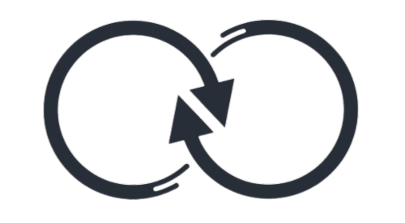

# Nextrade: The Modern Bartering Platform

**Nextrade** is a web application marketplace where users can barter items with one another—no money required! Built with Laravel and Blade, Nextrade provides a seamless platform for community-driven bartering, allowing users to list items, browse available trades, and connect with potential trading partners.

<p align="center">
  
</p>

---

## ✨ Key Features

- **User Authentication**: Secure registration and login system
- **Item Management**: Easily add, edit, and remove items for trade
- **Item Details**: Comprehensive view of each listed item
- **User Profiles**: Track your trades and manage your listings
- **Email Notifications**: Stay updated on your trade activities
- **Responsive Design**: Works seamlessly across all devices

---

## 🚀 Quick Start

### Prerequisites
- PHP >= 8.1
- Composer
- Node.js & npm
- MySQL/PostgreSQL database

### Installation

1. **Clone the repository**
   ```bash
   git clone https://github.com/yourusername/nextrade.git
   cd nextrade
   ```

2. **Install PHP dependencies**
   ```bash
   composer install
   ```

3. **Install Node.js dependencies**
   ```bash
   npm install
   ```

4. **Environment Setup**
   ```bash
   cp .env.example .env
   php artisan key:generate
   ```
   Update your `.env` file with your database credentials and other settings.

5. **Database Setup**
   ```bash
   php artisan migrate --seed
   ```

6. **Build Assets**
   For production:
   ```bash
   npm run build
   ```
   For development:
   ```bash
   npm run dev
   ```

7. **Start the Application**
   ```bash
   php artisan serve
   ```
   Visit [http://localhost:8000](http://localhost:8000) in your browser.

---

## 📝 Usage Guide

1. **Register** an account or **Login** if you already have one
2. **Browse** available items or **Add** your own items for trade
3. **View Item Details** to see more information about an item
4. **Contact** the item owner to arrange a trade
5. **Manage** your items and trades through your dashboard

---

## 🛠️ Tech Stack

- **Backend**: Laravel 10+
- **Frontend**: Blade, Tailwind CSS, Vanilla JavaScript
- **Database**: MySQL/PostgreSQL
- **Authentication**: Laravel Breeze
- **Email**: Laravel Mail

---

## 📂 Project Structure

```
app/Http/Controllers/  # Application controllers
resources/views/       # Blade templates
resources/js/          # Frontend JavaScript
resources/css/         # Stylesheets
routes/                # Application routes
```

---

## 🔄 Development Workflow

1. Create a new branch for your feature/fix:
   ```bash
   git checkout -b feature/your-feature-name
   ```
2. Make your changes and commit them:
   ```bash
   git add .
   git commit -m "Add your commit message"
   ```
3. Push to the branch and create a pull request

---

## 🤝 Contributing

We welcome contributions from the community! Please read our [contributing guidelines](CONTRIBUTING.md) before submitting pull requests.

---

## 📬 Contact

For questions or feedback, please open an issue in the repository or contact [your-email@example.com](mailto:your-email@example.com).

---

## 📄 License

This project is open-source and available under the [MIT License](LICENSE).

## Code of Conduct

In order to ensure that the Laravel community is welcoming to all, please review and abide by the [Code of Conduct](https://laravel.com/docs/contributions#code-of-conduct).

## Security Vulnerabilities

If you discover a security vulnerability within Laravel, please send an e-mail to Taylor Otwell via [taylor@laravel.com](mailto:taylor@laravel.com). All security vulnerabilities will be promptly addressed.

## Premium Partners

- **[Vehikl](https://vehikl.com)**
- **[Tighten Co.](https://tighten.co)**
- **[Kirschbaum Development Group](https://kirschbaumdevelopment.com)**
- **[64 Robots](https://64robots.com)**
- **[Curotec](https://www.curotec.com/services/technologies/laravel)**
- **[DevSquad](https://devsquad.com/hire-laravel-developers)**
- **[Redberry](https://redberry.international/laravel-development)**
- **[Active Logic](https://activelogic.com)**

If you discover a security vulnerability within Laravel, please send an e-mail to Taylor Otwell via [taylor@laravel.com](mailto:taylor@laravel.com). All security vulnerabilities will be promptly addressed.

## License

The Laravel framework is open-sourced software licensed under the [MIT license](https://opensource.org/licenses/MIT).
